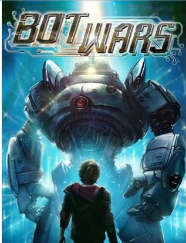

# Hacksprintn_PS14_BOT_WAR
## Team Bot War

Official Entry of Team Bot War, from SRM Institute of Science and Technology, Kattankulathur, to Hacksprint v2.0.  

PROJECT DESCRIPTION(VIDEO):https://drive.google.com/file/d/1wFwB4cCroSAV6sZ31hBGV5oJNx5safck/view?usp=sharing            
         PROJECT WEBSITE:https://5f6ed07a278576bc11d08409--dreamy-haibt-642a2f.netlify.app/

## Track and Problem Statement 🚧

***Web application for a music company***

## Background 📖

Music gives a soul to the universe, wings to the mind, flight to the imagination and life to everything.

**Where words fail, music speaks.**

## About Web_App for music 🔧
### What
WebApp for *music* is a **app** to help you find songs according to your mood. It is developed using HTML, CSS, React, spotify-api, materialize css,and lots of hardwork and passion.

### Why
Music is the food for our soul, and right kind of music for specific mood makes us feel better.

## Technology Stack 💻

Keeping it simple, no big words!
- HTML
- CSS
- React
- react-spotify-api
- open source packages

## Collaborators 🤖
- [Anjali Agrawal](https://www.github.com/anjaliagrawal28) - Team Lead
- [Mudit Mathur](https://www.github.com/muditmishra2020)
- [Shashwat Mishra](https://www.github.com/ampsteric)
- [Anindya Kumar Patro](https://www.github.com/Anindya-Kumar-Patro)

